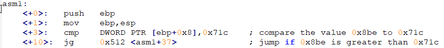
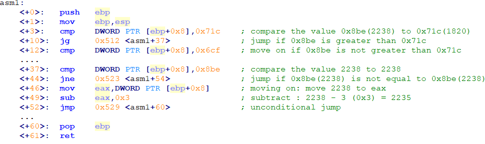

# Write Up - asm1

This is my first time writing a write-up on github. This challenge envolves assembly code, in the hints of it there's a site where you can access and learn some things about assembly (I needed to view more about the language to "understand" more).

## Score
**Points: 200**

## Description:
What does asm1(0x8be) return? Submit the flag as a hexadecimal value (starting with '0x'). NOTE: Your submission for this question will NOT be in the normal flag format. [Source](asm1.S)

## Hints:
assembly [conditions](https://www.tutorialspoint.com/assembly_programming/assembly_conditions.htm)

## Solution:
First thing to do is pay attention in the description where it says "*What does asm1(0x8be) return?*", it says to us that this value(0x8be) is an input value, which means we gonna read the sentences this way: [ebp+0x8] == 0x8be **-->** [ebp+0x8] is equal to the value 0x8be. 

This "program" simply check if the input value macthes with the statment, like: The line 3(<+3>) is doing a *comparation(cmp)* between [ebp+0x8](0x8be) and 0x7c1; The line 4(<+10>) is doing a jumping to the line <+37> if [ebp+0x8] is greater than 0x7c1, else it just move on.

So, we just need to verify the values and follow the flow. I did it this way to make it "easier". 

My flag in this case was: 0x8bb
